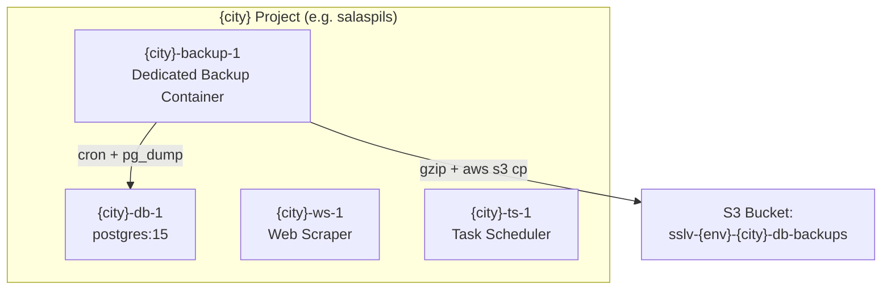

# M6 Phase 1: DB Backup Service Container Architecture

## Per-City Docker Compose Project

Each city is deployed as its own Docker Compose project using `--project-name <city>`.

```
[city project]
├── {city}-db-1          (postgres:15)
├── {city}-ws-1          (web scraper)
├── {city}-ts-1          (task scheduler)
└── {city}-backup-1      ← NEW: dedicated backup container
    ├── cron (inside container)
    ├── backup logic (adapted from backup_db_city.sh)
    └── direct access to {city}-db-1 network
```

## Mermaid Diagram (for better visualization)



## Key Points

- The **backup container** is dedicated per city.
- It runs its own **cron** (e.g. daily at 02:00).
- It has direct network access to the city's database.
- It uploads to the city's dedicated S3 bucket.
- Can be included in the main `docker-compose.yml` or managed via the multi-city deploy script.
- Replaces host-level cron scheduling.

## Container Responsibilities

| Container       | Role                          |
|-----------------|-------------------------------|
| {city}-db-1     | PostgreSQL database           |
| {city}-ws-1     | Web scraper application       |
| {city}-ts-1     | Task scheduler                |
| {city}-backup-1 | Scheduled DB backups to S3    |
