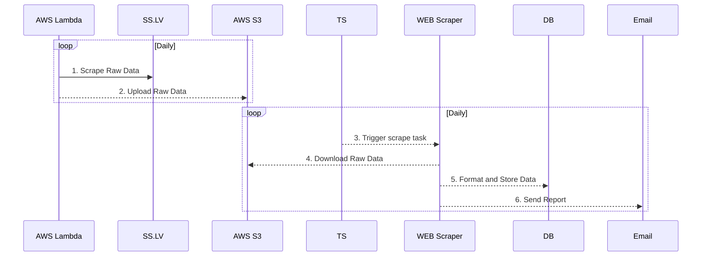

### Application Architecture Document

```mermaid
sequenceDiagram
loop Daily
  AWS Lambda->>SS.LV: 1. Scrape Raw Data
  AWS Lambda-->>AWS S3: 2. Upload Raw Data
end
loop Daily
  TS-->>WEB Scraper:3. Trigger scrape task
  WEB Scraper-->>AWS S3: 4. Download Raw Data
  WEB Scraper-->>DB: 5. Format and Store Data
  WEB Scraper-->>Email: 6. Send Report
end

```
